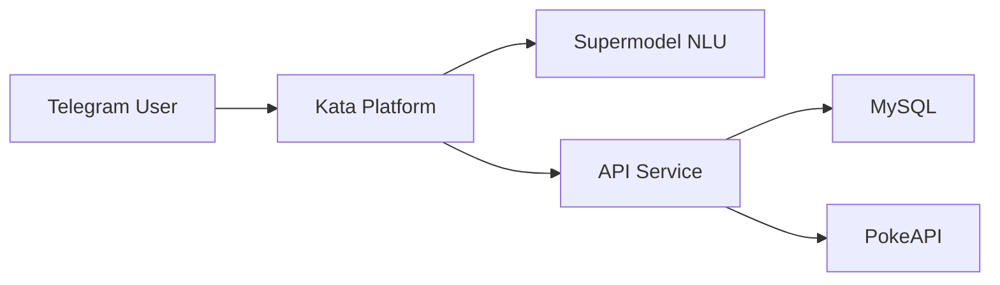

# Architecture

## System Overview

## Components

- **Kata Platform**: Manages conversation flow, validates names via Supermodel
- **API Service**: Node.js + Express on Vercel
- **MySQL**: Stores registered users
- **PokeAPI**: External Pokemon data source

## Deployment

- API: [https://kata-chatbot.vercel.app](https://kata-chatbot.vercel.app)
- Bot: [https://t.me/pokkemonTestBot](https://t.me/pokkemonTestBot)
