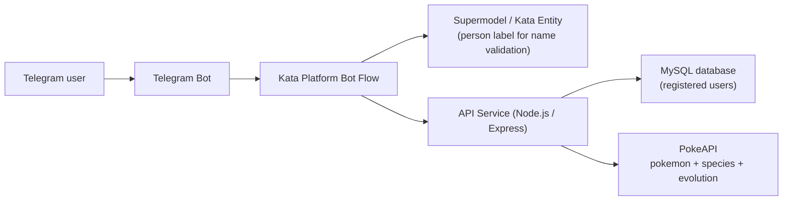

# Architecture Diagram

## Relationship summary

- Telegram delivers user messages to the bot channel configured in Kata Platform.
- Kata Platform manages the conversation flow:
  - asks for registration
  - validates the name using Supermodel `person`
  - calls external APIs using Sync API actions
- The API service stores the registered user in MySQL.
- The API service also fetches Pokemon data from PokeAPI, formats the detailed response, and returns JSON to Kata Platform.

## Suggested technology choices

- Chatbot platform: Kata Platform
- Messaging channel: Telegram
- API service: Node.js + Express
- Database: MySQL
- External data source: PokeAPI
