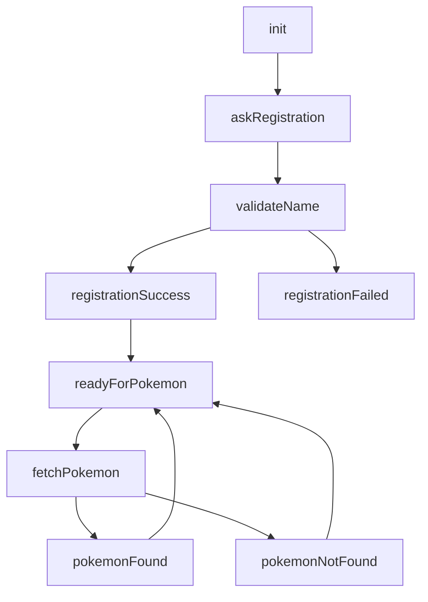

# Kata Dashboard UI Guide

This guide is adjusted for the Bot Studio UI shown in your screenshots.

## What is different in this UI

- You cannot save an empty state.
- Each state must have at least one action.
- When creating a state, you may only be able to define one transition.
- Additional transitions are usually added after the state is saved on the canvas.
- `onEnter` is the easiest place to set values such as `context.fullName` and `context.lastQuery`.

## Reference docs

- Kata Platform overview: [https://docs.kata.ai/kata-platform/introduction/about](https://docs.kata.ai/kata-platform/introduction/about)
- Bot Studio tutorial: [https://docs.kata.ai/tutorials/bot-studio](https://docs.kata.ai/tutorials/bot-studio)
- Supermodel guide: [https://docs.kata.ai/kata-platform/how-to/how-to-use-super-model-to-improve-your-bot-intelligence](https://docs.kata.ai/kata-platform/how-to/how-to-use-super-model-to-improve-your-bot-intelligence)
- Sync API guide: [https://docs.kata.ai/kata-platform/how-to/using-sync-api-to-access-third-party-application](https://docs.kata.ai/kata-platform/how-to/using-sync-api-to-access-third-party-application)
- Bot development FAQ: [https://docs.kata.ai/kata-platform/faqs/bot-development-faqs](https://docs.kata.ai/kata-platform/faqs/bot-development-faqs)

## Before configuring `validateName`

Build and run the API service first.

You already have the starter service in [`api-service/`](/Users/gaogao/Documents/New%20project/api-service/README.md). For Kata, `validateName` needs a real API URL for:

- `POST /api/register`

Kata's docs say:

- API action should return HTTP `200`
- response body should be JSON
- API timeout is short

So the best order is:

1. Run the API locally and test it.
2. Deploy it to a public URL.
3. Put that public URL into the Kata API action.

Current live API:

- `https://kata-chatbot.vercel.app`

## Intents vs States

Use this rule:

- Create `captureName`, `askPokemon`, `registerStatus`, and `pokemonStatus` in `Intents`
- Create `init`, `askRegistration`, `validateName`, `readyForPokemon`, and the rest in `States`
- Keep the main flow simple first, then add optional fallback states later

## Actual flow used in this project

This guide now follows the simpler flow based on your current diagram:



Optional:

- `invalidName` can be created as an extra helper state, but it is not part of the main flow in this guide because automatic default transitions can easily create loops in this UI.

## Recommended state order for this UI

Create and save the states in this order:

1. `init`
2. `askRegistration`
3. `validateName`
4. `registrationSuccess`
5. `registrationFailed`
6. `readyForPokemon`
7. `fetchPokemon`
8. `pokemonFound`
9. `pokemonNotFound`
10. `invalidName` optional later

This matches your actual diagram more closely than the older `entry`-based template.

## State-by-state setup

### `init`

Overview:

- State Name: `init`
- Initial State: `ON`
- End State: `OFF`

Actions:

- `initMessage`
  - type: `Text`
  - text: `Welcome. Type /start to begin.`

Transition:

- target: `askRegistration`
- condition:

```js
intent == 'startTelegram'
```

### `askRegistration`

Overview:

- State Name: `askRegistration`
- Initial State: `OFF`
- End State: `OFF`

Actions:

- `welcomeMessage`
  - type: `Text`
  - text: `Hi! I can help you with detailed Pokemon information.`
- `askNameMessage`
  - type: `Text`
  - text: `Before we continue, please type your full name for registration.`

Transition while creating:

- target: `validateName`
- condition:

```js
intent == 'captureName'
```

Do not add a default transition here in the main flow. Let this state wait for the next user message.

### `validateName`

Overview:

- State Name: `validateName`

Actions:

- `registerUserApi`
  - type: `API`
  - method: `POST`
  - URL: `https://kata-chatbot.vercel.app/api/register`
  - headers:

```json
{
  "Content-Type": "application/json"
}
```

  - body:

```json
{
  "telegramUserId": "$(metadata.senderId || metadata.telegramSenderId || '')",
  "telegramSenderName": "$(metadata.telegramSenderName || '')",
  "fullName": "$(context.fullName)",
  "channelType": "$(metadata.channelType || 'telegram')"
}
```

- `emitRegisterStatus`
  - type: `Command`
  - command: `register_status`
  - payload:

```json
{
  "success": "$(result.success)",
  "message": "$(result.message)",
  "user": "$(result.user)"
}
```

onEnter mapping:

- key: `context.fullName`
- value:

```text
attributes.name[0].value || attributes.name[0]
```

Transitions:

- to `registrationSuccess`
  - condition:

```js
intent == 'registerStatus' && payload.success
```

- to `registrationFailed`
  - condition: empty
  - `Default`: `ON`

### `registrationSuccess`

Action:

- `registrationSuccessMessage`
  - type: `Text`
  - text:

```text
$(payload.message)

Now ask me about a Pokemon, for example: pokemon pikachu
```

Transition:

- target: `readyForPokemon`
- `Default`: `ON`

### `registrationFailed`

Action:

- `registrationFailedMessage`
  - type: `Text`
  - text:

```text
$(payload.message || 'Registration failed. Please try again.')
```

Transition:

- target: `askRegistration`
- `Default`: `ON`

### `readyForPokemon`

Action:

- `pokemonHelpMessage`
  - type: `Text`
  - text:

```text
Ask me about any Pokemon, for example:
- pokemon pikachu
- tell me about charizard
- pokemon detail bulbasaur
```

Transition:

- target: `fetchPokemon`
- condition:

```js
intent == 'askPokemon'
```

### `fetchPokemon`

Actions:

- `fetchPokemonApi`
  - type: `API`
  - method: `POST`
  - URL: `https://kata-chatbot.vercel.app/api/pokemon/query`
  - headers:

```json
{
  "Content-Type": "application/json"
}
```

  - body:

```json
{
  "query": "$(context.lastQuery)"
}
```

- `emitPokemonStatus`
  - type: `Command`
  - command: `pokemon_status`
  - payload:

```json
{
  "success": "$(result.success)",
  "message": "$(result.message)",
  "pokemonName": "$(result.data.name)"
}
```

onEnter mapping:

- key: `context.lastQuery`
- value: `content`

Transitions:

- to `pokemonFound`
  - condition:

```js
intent == 'pokemonStatus' && payload.success
```

- to `pokemonNotFound`
  - condition: empty
  - `Default`: `ON`

### `pokemonFound`

Action:

- `pokemonDetailMessage`
  - type: `Text`
  - text: `$(payload.message)`

Transition:

- target: `readyForPokemon`
- `Default`: `ON`

### `pokemonNotFound`

Action:

- `pokemonNotFoundMessage`
  - type: `Text`
  - text:

```text
$(payload.message || 'Sorry, I could not find that Pokemon.')
```

Transition:

- target: `readyForPokemon`
- `Default`: `ON`

## How to add a second transition

If the create-state form only allows one transition:

1. Create the state with its first action and first transition.
2. Save the state.
3. Return to the canvas.
4. Click the state node or drag from its connector.
5. Create the second transition there.

Example:

- first create `init -> askRegistration`
- then after save, add transitions such as `validateName -> registrationFailed` or `fetchPokemon -> pokemonNotFound`

## Optional `invalidName`

If you want to add `invalidName` later, use it only after the main flow is already stable.

Suggested setup:

- State Name: `invalidName`
- Action text: `I couldn't detect a proper person name. Please type your real full name, for example: Ash Ketchum.`
- Transition back to `askRegistration`

Practical warning:

- in this UI, default transitions from waiting states can easily create loops, so do not wire `askRegistration -> invalidName` as an immediate default transition unless you have tested it carefully

## API verification before connecting Kata

Before you configure the Kata API action, verify the registration API works.

See [`api-service/README.md`](/Users/gaogao/Documents/New%20project/api-service/README.md) for setup and test commands.

Telegram bot channel for final testing:

- [https://t.me/pokkemonTestBot](https://t.me/pokkemonTestBot)
