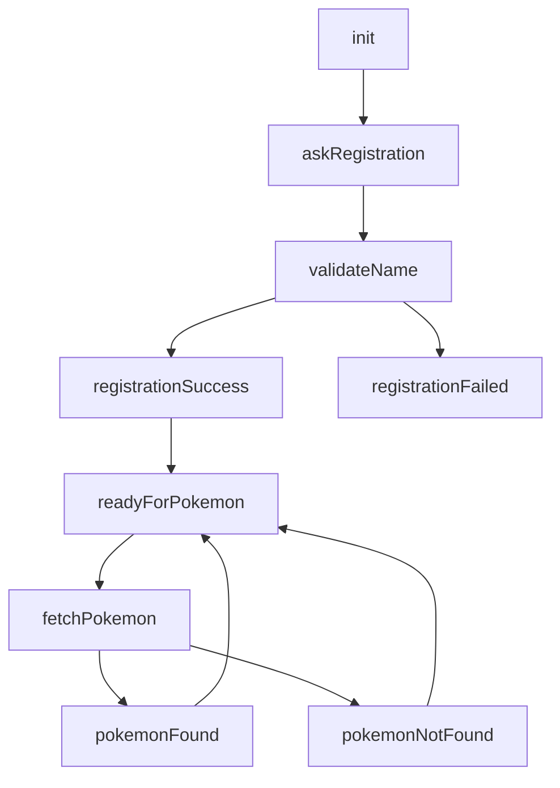

# Kata Bot Studio Setup Guide

## Bot Flow



## Intents

Create these in Bot Studio:

- **captureName**: Text intent with Supermodel NLU matching `person`
- **askPokemon**: Text intent matching `/pokemon|info|detail|about|information/i.test(content)`
- **startTelegram**: Initial text intent with `content == '/start'`
- **registerStatus**: Command intent with `content == 'register_status'`
- **pokemonStatus**: Command intent with `content == 'pokemon_status'`
- **reenter**: Command intent with `content == 'reenter'`

## States Setup Order

1. `init`
2. `askRegistration`
3. `validateName`
4. `registrationSuccess`
5. `registrationFailed`
6. `readyForPokemon`
7. `fetchPokemon`
8. `pokemonFound`
9. `pokemonNotFound`

## State Configurations

### `init`

**Settings**: Initial State: ON

**Actions**:

- Text: `Welcome. Type /start to begin.`

**Transition**: → `askRegistration` when `intent == 'startTelegram'`

---

### `askRegistration`

**Actions**:
- Text: `Hi! I can help you with detailed Pokemon information.`
- Text: `Before we continue, please type your full name for registration.`

**Transition**: → `validateName` when `intent == 'captureName'`

---

### `validateName`

**onEnter**: Set `context.fullName = attributes.name[0].value || attributes.name[0]`

**Actions**:

1. **API Action** - POST `https://kata-chatbot.vercel.app/api/register`
   ```json
   {
     "telegramUserId": "$(metadata.senderId || metadata.telegramSenderId || '')",
     "telegramSenderName": "$(metadata.telegramSenderName || '')",
     "fullName": "$(context.fullName)",
     "channelType": "$(metadata.channelType || 'telegram')"
   }
   ```

2. **Command** `register_status` with payload:
   ```json
   {
     "success": "$(result.success)",
     "message": "$(result.message)",
     "user": "$(result.user)"
   }
   ```

**Transitions**:
- → `registrationSuccess` when `intent == 'registerStatus' && payload.success`
- → `registrationFailed` (default)

---

### `registrationSuccess`

**Actions**:
- Text: `$(payload.message)\n\nNow ask me about a Pokemon, for example: pokemon pikachu`

**Transition**: → `readyForPokemon` (default)

---

### `registrationFailed`

**Actions**:
- Text: `$(payload.message || 'Registration failed. Please try again.')`

**Transition**: → `askRegistration` (default)

---

### `readyForPokemon`

**Actions**:
- Text: `Ask me about any Pokemon, for example:\n- pokemon pikachu\n- tell me about charizard\n- pokemon detail bulbasaur`

**Transition**: → `fetchPokemon` when `intent == 'askPokemon'`

---

### `fetchPokemon`

**onEnter**: Set `context.lastQuery = content`

**Actions**:

1. **API Action** - POST `https://kata-chatbot.vercel.app/api/pokemon/query`
   ```json
   {
     "query": "$(context.lastQuery)"
   }
   ```

2. **Command** `pokemon_status` with payload:
   ```json
   {
     "success": "$(result.success)",
     "message": "$(result.message)",
     "pokemonName": "$(result.data.name)"
   }
   ```

**Transitions**:
- → `pokemonFound` when `intent == 'pokemonStatus' && payload.success`
- → `pokemonNotFound` (default)

---

### `pokemonFound`

**Actions**:
- Text: `$(payload.message)`

**Transition**: → `readyForPokemon` (default)

---

### `pokemonNotFound`

**Actions**:
- Text: `$(payload.message || 'Sorry, I could not find that Pokemon.')`

**Transition**: → `readyForPokemon` (default)

---

## Notes

- Each state requires at least one action
- Add multiple transitions after saving the state
- Test API locally before connecting: see [api-service/README.md](../api-service/README.md)
